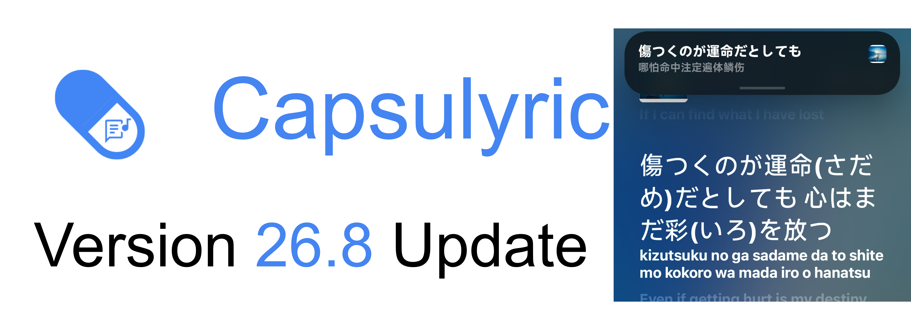

<!-- 
Push this file with a commit message starting with [release] to trigger a release build.

Commit format examples:
  [release]              → Auto version (e.g. 26.6.Stable_C1234)
  [release]26.6.1        → 26.6.1.Stable_C{commitCount}
  [release]26.6.Preview  → 26.6.Preview_C{commitCount} (pre-release)
  [release]Preview       → {YY}.{M}.Preview_C{commitCount} (pre-release)

The Preview flag below overrides any channel in the commit message.
Set to `true` to force a pre-release build regardless of commit message.
-->

## Release Metadata
- **Preview**: `false`

## 🇨🇳 更新日志

**功能更新**
- 新增一种小米超级岛通知样式，支持双行文本显示与右侧图片自定义
- 支持隐藏桌面图标
- 支持锁屏时隐藏通知
- 新增纯音乐专辑标记功能

**体验优化**
- 重构设置页架构，拆分为胶囊与通知、桌面歌词、个性化设置独立页面，分离公告系统与关于页，新增本地歌词独立页面
- 优化部分场景下的胶囊视觉样式
- 优化miuix页面的视觉表现
- 为material页面引入模糊效果
- 支持公平运行内存分配策略
- 优化桌面歌词与首页歌词的第二句展示方式
- 优化通知设置页面布局与逻辑层级
- 新增问卷星在线反馈渠道
- 优化重匹配入口触发逻辑，支持首句播放前或无内容时提前进入在线歌词调整页

**本地化与内容**
- 替换部分硬编码英文占位文案
- 调整部分过时文案表述
- 更新项目版权声明信息

## 🇬🇧 Change Log

**Feature Updates**
- Added Xiaomi Super Island notification style with dual-line text display and customizable right-side image
- Added Hide App Icon
- Added Hide notification on lock screen
- Added pure music album tagging feature

**Enhancements**
- Restructured Settings into independent pages for Capsule & Notifications, Desktop Lyrics, and Personalization, separated Announcements and About pages, added dedicated local lyrics entry
- Refined Capsule visual styling in selected scenarios
- Optimized the visual presentation of MIUI pages 
- Introduced a blur effect to the Material page
- Added fair runtime memory allocation support
- Optimized the display method of secondary lyric od home lyric preview and floating lyric
- Optimized layout and logical hierarchy of notification settings page
- Added Wjx online feedback channel
- Optimized re-match entry logic, allowing early access to online lyrics adjustment before the first line plays or when content is unavailable

**Localization & Content**
- Replaced hardcoded English placeholder text
- Refined outdated interface copy for improved accuracy
- Updated project copyright information