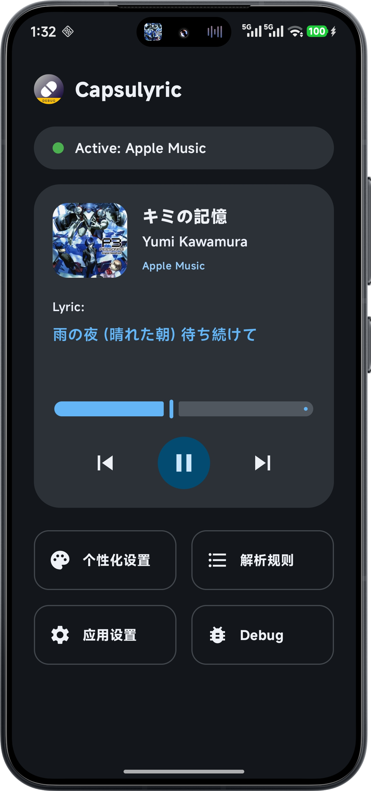
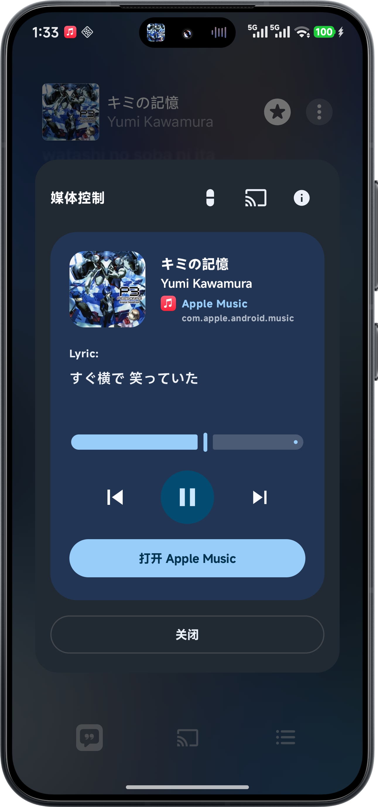
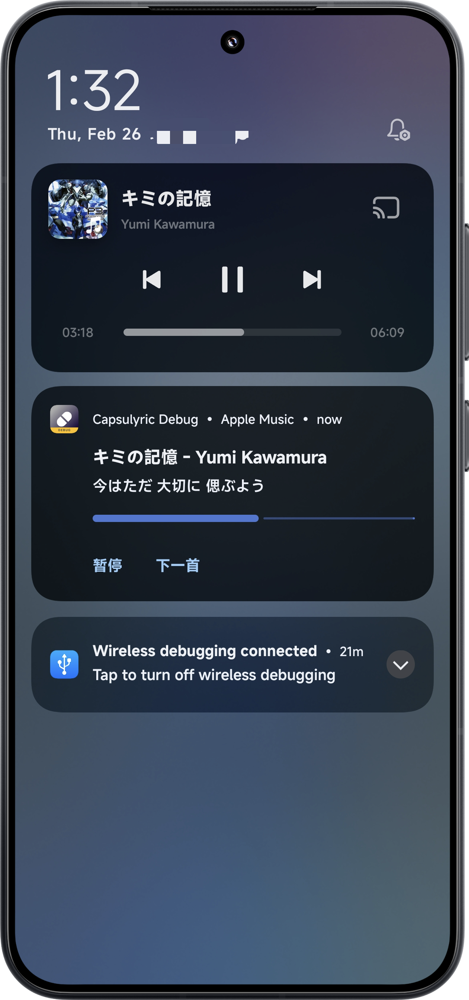
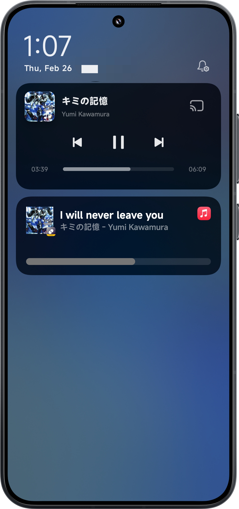
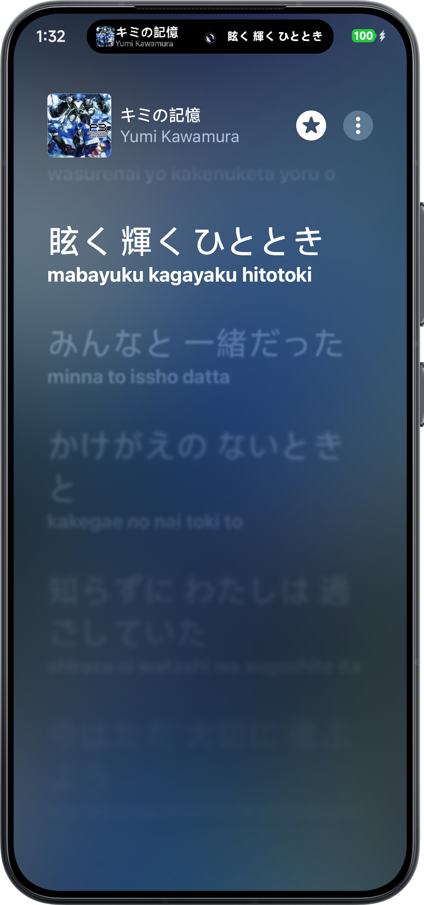
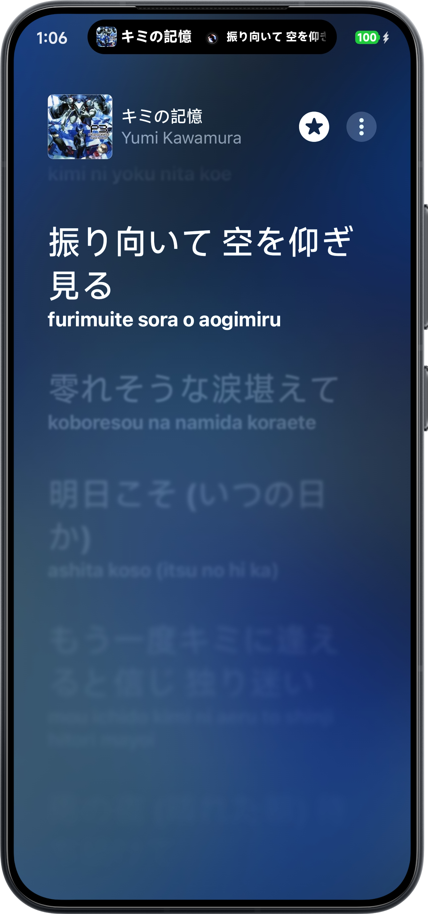

# Capsulyric

[](https://github.com/FrancoGiudans/Capsulyric/releases/latest)
[](https://github.com/FrancoGiudans/Capsulyric/releases)
[](LICENSE)

> **Provides status bar lyrics based on Live Update.**
> **提供基于 Live Update 机制的状态栏歌词。**

---

## Compatibility (兼容性)

* **Android Version**: Android 16+ (Baklava)
* **HyperOS**: Version 3.0.300+ (Required for Live Update model)

---

## Working Modes (工作模式)

### 1. Live Update
* **Requirements**: Android 16+
* **Special Note**: For HyperOS devices, OS version 3.0.300+ is required.
> 要求 Android 16+。针对小米设备，需 HyperOS 3.0.300+ 版本。

### 2. 小米超级岛 (Xiaomi Super Island)
* **Requirements**: HyperOS 3.0+
* **System**: Root access is required.
> 要求 HyperOS 3.0+，且系统需要 Root 权限。

---

## Lyric Acquisition (歌词获取方式)

1. **媒体通知歌词 (Media Notification Lyrics)**
   * Detects lyrics from standard media notifications.
2. **在线歌词 (Online Lyrics)**
   * Fetches lyrics from online servers based on playback info.
3. **Superlyric API**
   * **Requirements**: Root access is required.
   * High performance and accurate lyric syncing.

---

## Screenshots (效果展示，展示机型为小米15，系统版本为HyperOS 3.0.300.7 Beta，展示版本为1.3_C219)

### App UI (界面风格)
<p align="center">
  <b>Material Design</b> &nbsp;&nbsp;vs&nbsp;&nbsp; <b>MIUIX</b><br><br>
  
  
  <br><br>
  <b>Media Control (媒体控制弹窗)</b><br><br>
  
  
</p>

### Notification & Capsule (通知与胶囊)
<p align="center">
  <b>Live Update</b> &nbsp;&nbsp;vs&nbsp;&nbsp; <b>小米超级岛 (Xiaomi Super Island)</b><br><br>
  <b>Notification (展开形态)</b><br><br>
  
  
  <br><br>
  <b>Capsule (胶囊形态)</b><br><br>
  
  
</p>

---

## FAQ (常见问题解答)

<details>
<summary><b>Q1: 如何使用免 Root（0-Hook）模式？ (How to setup 0-Hook mode?)</b></summary>
<br>

该模式利用“媒体通知歌词”获取歌词。
支持 **QQ音乐**、**小米音乐** 和 **网易云音乐**。

- **网易云用户 (NetEase)**: 连接蓝牙音频后，进入 左上角菜单 -> 设置 -> 通用 -> 开启“外接设备蓝牙歌词”。
- **QQ音乐用户 (QQ Music)**: 连接蓝牙音频后，进入 右上角菜单 -> 设置 -> 开启“车载蓝牙歌词”。
- **小米音乐用户 (Xiaomi Music)**: 进入设置开启“通知栏歌词”。

*注意：必须授予本应用“通知使用权”，并确保音乐 App 通知栏显示正常。*
</details>

<details>
<summary><b>Q2: 为什么我看不到歌词？ (Why can't I see lyrics?)</b></summary>
<br>

请按照以下步骤逐一排查：
1. **检查权限**: 请确保应用已获得所有必要的系统权限（尤其是通知使用权）。
2. **确认系统版本**: 推荐 Android 16+ 或 HyperOS 3.0.300+。低于 3.0.300 的 HyperOS 无法显示原生实时通知。
3. **检查第三方音乐App设置**: 部分版本可能需要连接耳机才能触发“车载蓝牙歌词”。如果使用 SuperLyric API（如 Apple Music），需安装相应模块并启用。
4. **在线歌词限制**: 如果使用在线歌词，可能因网络或 API 限制暂时无法获取准确歌词。
</details>

<details>
<summary><b>Q3: 为什么首页一直提示“无法连接到服务”？ (Why does it say "Cannot connect to service"?)</b></summary>
<br>

这通常是由于系统自动回收了权限导致的。部分系统会限制应用“通知使用权”的授权时长。
**解决方法**: 请前往系统设置，重新授予本应用的通知使用权。
</details>

<details>
<summary><b>Q4: 如何获取日志 (Log) 提交反馈？ (How to get logs?)</b></summary>
<br>

如果遇到无法解决的问题，建议在 GitHub 提交 Issue 时附带日志：
- **Debug 版本**: 自带 Log Console，可直接查看并复制日志。
- **Release 版本**: 在 App 内找到版本号或 Commit 号，连续点击多次即可唤出 Log Console。
</details>

---

## Privacy (隐私说明)

* **No Data Transmission**: If **Online Lyrics** is disabled, the app does not transmit any data. Everything stays local.
* **Online Mode**: When **Online Lyrics** is enabled, only playback information (title, artist, album) is sent to the API interface to fetch lyrics.
> **隐私声明**：如果不开启“在线歌词”功能，本软件不会传输任何数据。开启后，只会向 API 接口发送当前播放信息以获取歌词。

---

## Build (构建)

```bash
git clone https://github.com/FrancoGiudans/Capsulyric.git
cd Capsulyric
./gradlew assembleDebug
```

---

## 开源协议 / License

本项目基于 [GPL-3.0](LICENSE) 协议开源。

[](https://www.gnu.org/licenses/gpl-3.0)

---

## Credits (致谢)

* [SuperLyric](https://github.com/HChenX/SuperLyric) (GPL-3.0)
* [SuperLyricAPI](https://github.com/HChenX/SuperLyricApi) (LGPL-2.1)
* [InstallerX Revive](https://github.com/wxxsfxyzm/InstallerX-Revived) (GPL-3.0)
* [Lyricify-Lyrics-Helper](https://github.com/WXRIW/Lyricify-Lyrics-Helper) (Apache-2.0)
* [compose-miuix-ui/miuix](https://github.com/compose-miuix-ui/miuix) (Apache-2.0)
