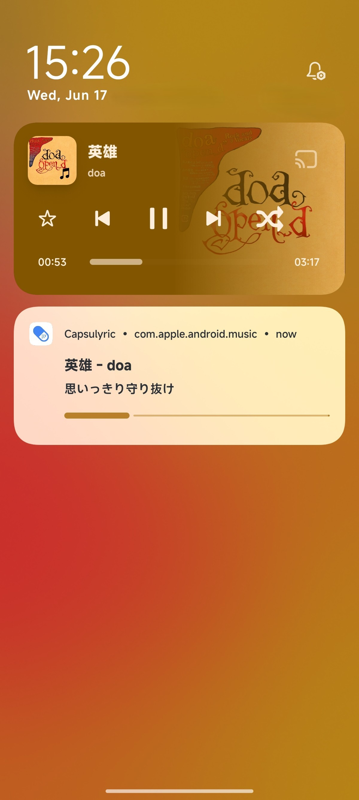
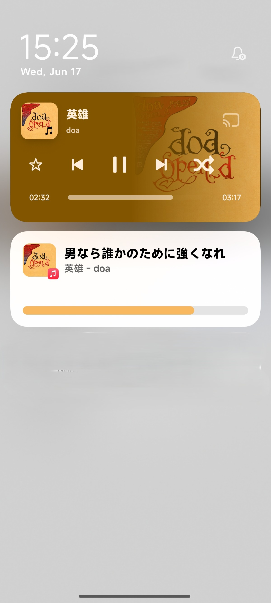

#  Capsulyric

[](https://github.com/FrancoGiudans/Capsulyric/releases/latest)
[](https://github.com/FrancoGiudans/Capsulyric/releases)
[](LICENSE)

> **Provides status bar lyrics based on Live Update and Xiaomi SuperIsland.**

## Compatibility & Requirements (兼容性与要求)

| Functions / 功能 | Requirements / 要求 | Supported Devices / 支持机型 |
| :--- | :--- | :--- |
| **Live Update (实况通知)** | Android 16+ <br> | Xiaomi HyperOS (3.0.300 required, Verified) <br> ColorOS, OneUI, AOSP (Community) |
| **Xiaomi Super Island (小米超级岛)** | HyperOS 3.0 <br> & Android 15+ | HyperOS devices with <br> Root or Shizuku |

> [!NOTE]
> Systems below Android 16 or HyperOS 3.0 do not support native dynamic lyrics.
> 低于 Android 16 或 HyperOS 3.0 的系统不支持原生动态歌词。

---

## Working Modes (工作模式)

### 1. Live Update (实况通知)
*   **EN:** Generally supports **Android 16+**. For **HyperOS**, version **3.0.300+** is required.
*   **CN:** 要求 **Android 16+**。针对小米设备，需要 **HyperOS 3.0.300+** 版本。

### 2. Xiaomi Super Island (小米超级岛)
*   **EN:** Requires **HyperOS 3.0**. System requires **Root access** or **Shizuku**.
*   **CN:** 要求 **HyperOS 3.0**。系统需要 **Root 权限** 或 **Shizuku** 环境。

---

## Lyric Acquisition (歌词获取方式)

| Method / 方式 | Description / 说明 |
| :--- | :--- |
| **Media Notification** | Detects lyrics from standard notifications. / 从标准通知栏提取。 |
| **Online Lyrics** | Fetches from online servers. Supports translations & romanization. / 从互联网服务器获取，支持翻译与罗马音。 |
| **Superlyric API** | High accuracy (Root/LSPosed required). / 准确度高（需 Root/LSPosed）。 |
| **Lyric Getter** | Supports Meizu & LSPatch (non-root). / 支持魅族状态栏歌词及免 Root 注入。 |
| **Lyricon API** | Root/LSPosed required. / 需 Root/LSPosed。 |
| **Local Lyric** | Based on local .lrc files with auto-matching. / 基于本地 .lrc 歌词文件，支持自动匹配。 |

---

## Screenshots (效果展示)
*(展示机型：Xiaomi 15 | 系统版本：HyperOS 3.0.300.7 Beta | 展示应用版本：Version.26.6.2.Stable_C488)*

### App UI (界面风格)
<p align="center">
  <b>Material Design</b> &nbsp;&nbsp;vs&nbsp;&nbsp; <b>MIUIX</b><br><br>
  
  
</p>

### Media Control (媒体控制弹窗)
<p align="center">
  
  
</p>

### Notification (通知形态)
<p align="center">
  <b>Live Update (实况通知)</b> &nbsp;&nbsp;vs&nbsp;&nbsp; <b>Xiaomi Super Island (小米超级岛)</b><br><br>
  
  
</p>

### Capsule (胶囊形态)
<p align="center">
  
  
</p>

---

## FAQ (常见问题解答)

<details>
<summary><b>Q1: 如何添加解析规则？ (How to add parser rules?)</b></summary>

> **CN:**
> 1. **开启应用设置**：确认音乐应用内已开启“通知栏歌词”或“车载蓝牙歌词”。
> 2. **添加解析规则**：在“解析规则”页面手动添加或使用“推荐”。
> 3. **配置逻辑**：选择对应的“分隔符”和“顺序”并重启音乐应用。
>
> **EN:**
> 1. **Enable App Settings**: Ensure "Notification/Car Lyrics" is enabled in your music app.
> 2. **Add Rule**: Manually add or use "Recommend" in the Parser Rules page.
> 3. **Configure**: Select the correct "Separator" and "Order", then restart the music app.
</details>

<details>
<summary><b>Q2: 如何使用小米超级岛？ (How to use Xiaomi Super Island?)</b></summary>

> **CN:**
> - **已 Root**：推荐使用 HyperCeiler 插件解除白名单限制。
> - **未 Root**：授权 Shizuku 并开启“绕过小米超级岛白名单”。注意可能导致耗电增加或消息延迟。
>
> **EN:**
> - **Rooted**: Recommended to use HyperCeiler to bypass the whitelist.
> - **Non-rooted**: Authorize Shizuku and enable "Bypass Xiaomi Super Island Whitelist". Note potential battery impact or message delay.
</details>

<details>
<summary><b>Q3: 为什么看不到歌词？ (Why can't I see lyrics?)</b></summary>

> **CN:**
> 1. **检查权限**: 确保“通知使用权”已开启。
> 2. **版本要求**: 需 **Android 16+** 或 **HyperOS 3.0.300+**。低于 3.0.300 的 HyperOS 无法显示原生实况通知。
> 3. **App设置**: 确认音乐 App 的蓝牙/通知歌词开关已打开。
>
> **EN:**
> 1. **Permissions**: Check "Notification Access".
> 2. **System**: Requires **Android 16+** or **HyperOS 3.0.300+**. HyperOS below 3.0.300 cannot show native live notifications.
> 3. **App Settings**: Ensure lyrics settings are enabled in your music player.
</details>

<details>
<summary><b>Q4: 无法连接服务？ (Cannot connect to service?)</b></summary>

> **CN:** 系统回收了权限。请重新手动授予“通知使用权”。
>
> **EN:** Permission revoked by system. Please re-grant "Notification Access".
</details>

<details>
<summary><b>Q5: 如何备份/恢复设置？ (How to backup/restore settings?)</b></summary>

> **CN:** 前往 设置 → 备份与恢复，支持按类别（胶囊、通知、外观、通用、解析规则、高级等）选择导出或导入。
>
> **EN:** Go to Settings → Backup & Restore. Supports granular category selection (Capsule, Notifications, Appearance, General, Parser Rules, Advanced, etc.) for export/import.
</details>

<details>
<summary><b>Q6: 如何反馈问题？ (How to submit feedback?)</b></summary>

> **CN:** 请前往 [GitHub Issues](https://github.com/FrancoGiudans/Capsulyric/issues/new?template=bug_report.yml) 提交反馈，并附带通过点击版本号唤出的 **Log Console** 日志。
>
> **EN:** Please submit an issue at [GitHub Issues](https://github.com/FrancoGiudans/Capsulyric/issues/new?template=bug_report.yml) with logs from the **Log Console** (tap version/commit to open).
</details>

---

## Privacy (隐私说明)

This app needs to read notifications to get lyrics and playback information.

We only read media playback notification content, including: album art, artist, song title, album name, and the package name of the app currently playing media.
The above information is used solely for:
- Reading and displaying playback information
- Extracting lyrics from media notifications
- Matching online lyrics when Online Lyrics is enabled
- Sending now playing and scrobble records to Last.fm when Last.fm scrobbling is enabled and connected
- App self-logging for diagnostics

We do NOT read chat messages, verification codes, emails, or any non-media notifications. Processing stays on your device by default. Network requests are only made for features you explicitly enable, such as Online Lyrics or Last.fm.

For Last.fm, Capsulyric uses API credentials supplied by the user. When enabled, it may send track title, artist, album, duration, and playback timestamp to Last.fm for now-playing updates and scrobbles. Last.fm API credentials and session keys are encrypted locally with Android Keystore-backed AES-GCM storage, and are excluded from Capsulyric setting exports and Android backup/device-transfer rules.

本应用需要读取通知以获取歌词与播放信息。

我们仅会读取媒体播放通知的内容，包括：专辑图片、歌手、歌名、专辑名，以及正在播放媒体的应用包名。
上述信息仅用于以下用途：
- 播放信息的读取和显示
- 媒体通知歌词的提取
- 开启在线歌词后用以匹配在线歌词
- 开启并连接 Last.fm 后向 Last.fm 发送正在播放与 scrobble 记录
- 应用记录自身日志

我们不会读取您的聊天消息、验证码、邮件等非媒体类通知。默认情况下数据在本机处理；只有在您明确开启在线歌词或 Last.fm 等功能时，才会发起相应网络请求。

Last.fm 使用由用户自行提供的 API 凭据。开启后，Capsulyric 可能会将歌名、歌手、专辑、时长和播放时间发送给 Last.fm，用于正在播放状态和 scrobble 记录。Last.fm API 凭据与 session key 会使用 Android Keystore 支持的 AES-GCM 存储在本机，并排除在 Capsulyric 配置导出以及 Android 备份/设备迁移规则之外。

## Project Structure (项目结构)

The Android app is organized by responsibility rather than by a single flat feature folder. The main package groups are:

项目主体按职责拆分，主要包职责如下：

```text
app/
  core/         Shared platform utilities, settings, logging, cache, update, and theme helpers.
                通用平台能力、设置、日志、缓存、更新与主题辅助。
  lyrics/       Lyric sources, online fetching, parsing, scoring, local lyrics, cache, export, and repository state.
                歌词来源、在线获取、解析、评分、本地歌词、缓存、导出与仓库状态。
  runtime/      Foreground services, media-session monitoring, notification control, and playing-app integration.
                前台服务、媒体会话监听、通知控制与播放应用集成。
  feature/      Screen-level business features such as settings, parser rules, diagnostics, cache management, and OOBE.
                页面级业务功能，例如设置、解析规则、诊断、缓存管理和首次引导。
  ui/           Reusable UI, Material/Miuix themes, overlay renderers, capsule, and Super Island display logic.
                可复用 UI、Material/Miuix 主题、悬浮层渲染、胶囊和超级岛展示逻辑。
  integration/  Bridges to privileged or external APIs, including Shizuku and system-level integrations.
                Shizuku 等特权/外部 API 与系统级集成入口。
  rules/        Parser-rule models, matching helpers, and rule-management support.
                解析规则模型、匹配辅助与规则管理支撑。
```

Build configuration is split between `app/build.gradle` and reusable scripts under `gradle/scripts/`, keeping versioning, signing, and Android app options separate.

构建配置由 `app/build.gradle` 与 `gradle/scripts/` 下的脚本共同维护，用于拆分版本号、签名和 Android 应用配置。

For package boundaries and runtime data flow, see [Architecture](docs/ARCHITECTURE.md).

更详细的包边界与运行时数据流说明见 [Architecture](docs/ARCHITECTURE.md)。

---

## Build (构建)

```bash
git clone https://github.com/FrancoGiudans/Capsulyric.git
cd Capsulyric
./gradlew assembleDebug
```

---

## License (开源协议)

Projects is licensed under [GPL-3.0](LICENSE).

[](https://www.gnu.org/licenses/gpl-3.0)

---

## Credits (致谢)

*   [HChenX/SuperLyric](https://github.com/HChenX/SuperLyric) (GPL-3.0)
*   [HChenX/SuperLyricAPI](https://github.com/HChenX/SuperLyricApi) (LGPL-2.1)
*   [xiaowine/Lyric Getter API](https://github.com/xiaowine/Lyric-Getter-Api) (LGPL-2.1)
*   [wxxsfxyzm/InstallerX Revive](https://github.com/wxxsfxyzm/InstallerX-Revived) (GPL-3.0)
*   [WXRTW/Lyricify-Lyrics-Helper](https://github.com/WXRIW/Lyricify-Lyrics-Helper) (Apache-2.0)
*   [compose-miuix-ui/miuix](https://github.com/compose-miuix-ui/miuix) (Apache-2.0)
*   [xzakota/HyperNotification](https://github.com/xzakota/HyperNotification) (Apache-2.0)
