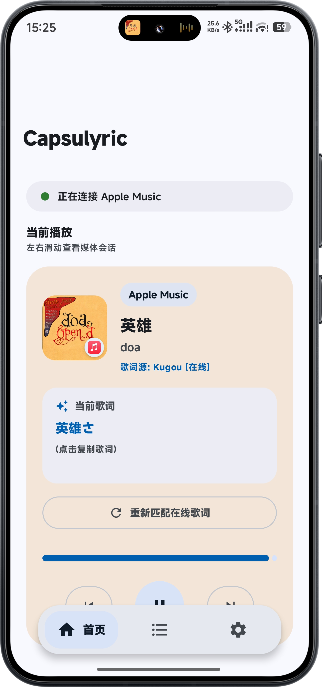
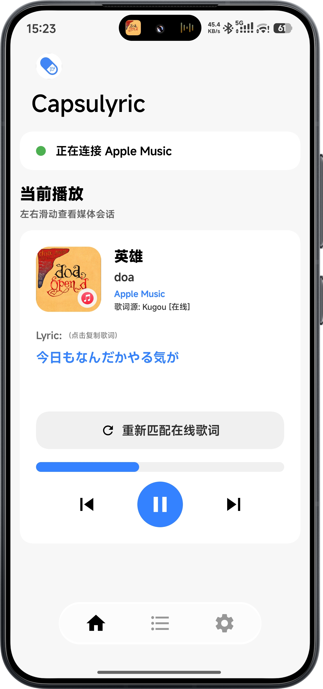
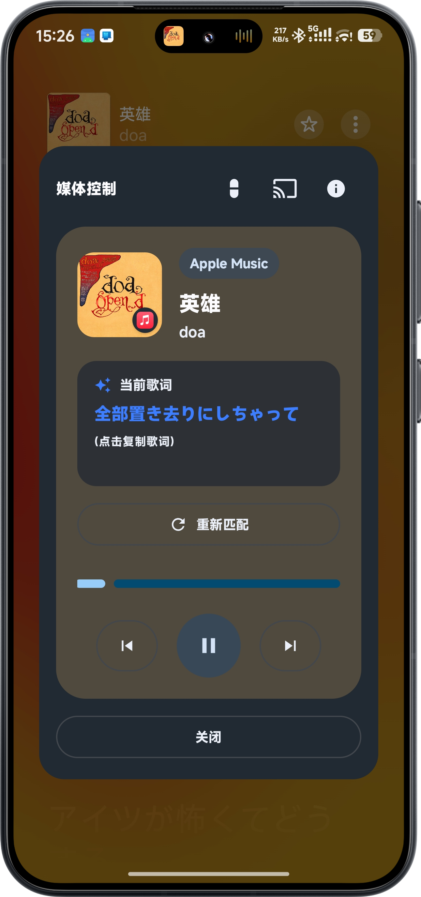
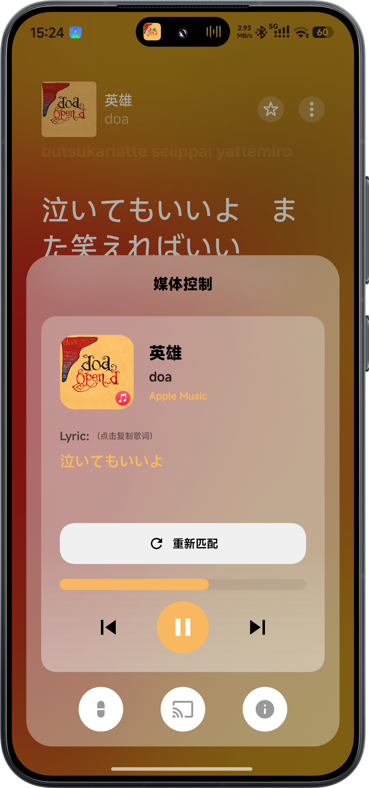
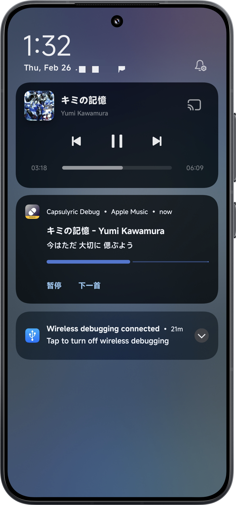
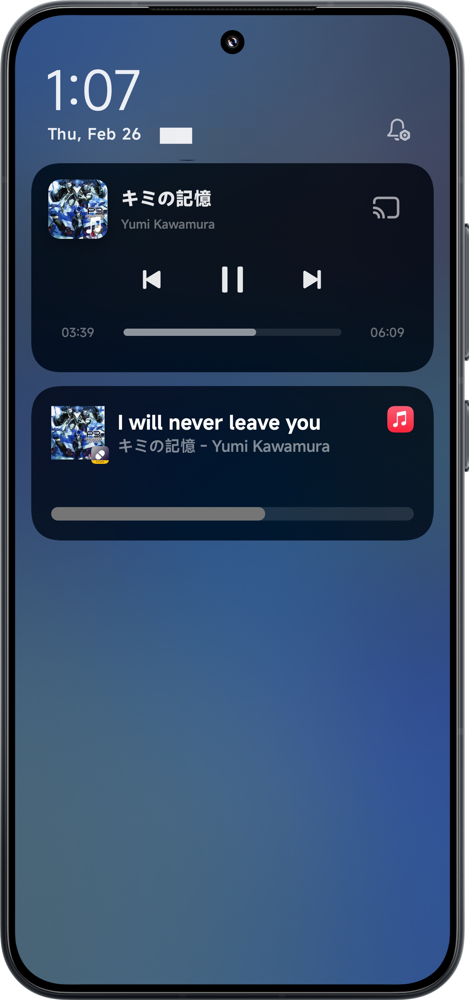
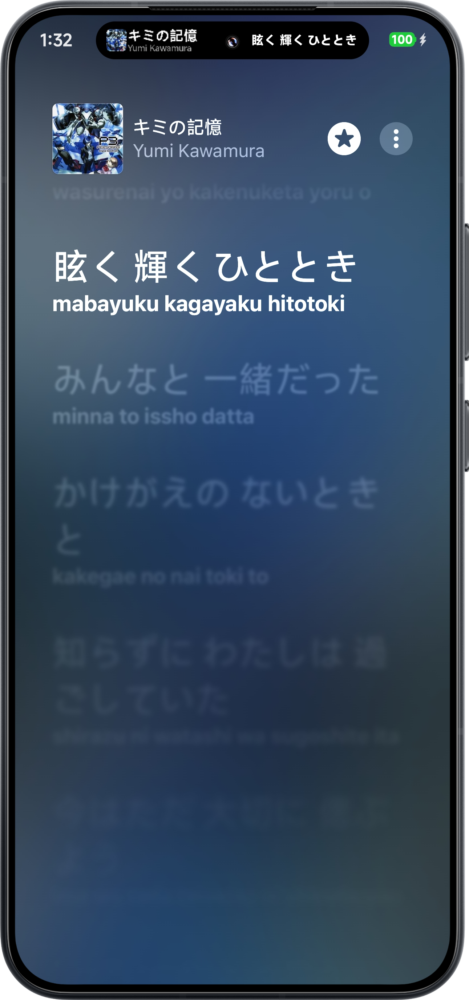
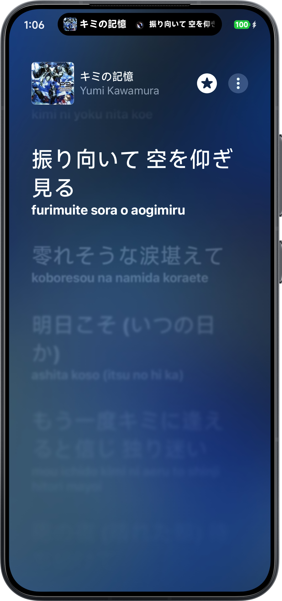

#  Capsulyric

[](https://github.com/FrancoGiudans/Capsulyric/releases/latest)
[](https://github.com/FrancoGiudans/Capsulyric/releases)
[](LICENSE)

> **Provides status bar lyrics based on Live Update and Xiaomi SuperIsland.**

## Compatibility & Requirements (兼容性与要求)

| Functions / 功能 | Requirements / 要求 | Supported Devices / 支持机型 |
| :--- | :--- | :--- |
| **Live Update (实况通知)** | Android 16+ <br> | Xiaomi HyperOS (3.0.300 required, Verified) <br> ColorOS, OneUI, AOSP (Community) |
| **Xiaomi Super Island (小米超级岛)** | HyperOS 3.0 <br> & Android 15+ | HyperOS devices with <br> Root or Shizuku |

> [!NOTE]
> Systems below Android 16 or HyperOS 3.0 do not support native dynamic lyrics.
> 低于 Android 16 或 HyperOS 3.0 的系统不支持原生动态歌词。

---

## Working Modes (工作模式)

### 1. Live Update (实况通知)
*   **EN:** Generally supports **Android 16+**. For **HyperOS**, version **3.0.300+** is required.
*   **CN:** 要求 **Android 16+**。针对小米设备，需要 **HyperOS 3.0.300+** 版本。

### 2. Xiaomi Super Island (小米超级岛)
*   **EN:** Requires **HyperOS 3.0** & **Android 15+**. System requires **Root access** or **Shizuku**.
*   **CN:** 要求 **HyperOS 3.0** 且 **Android 15+**。系统需要 **Root 权限** 或 **Shizuku** 环境。

---

## Lyric Acquisition (歌词获取方式)

| Method / 方式 | Description / 说明 |
| :--- | :--- |
| **Media Notification** | Detects lyrics from standard notifications. / 从标准通知栏提取。 |
| **Online Lyrics** | Fetches from online servers. / 从互联网服务器获取。 |
| **Superlyric API** | High accuracy (Root/LSPosed required). / 准确度高（需 Root/LSPosed）。 |
| **Lyric Getter** | Supports Meizu & LSPatch (non-root). / 支持魅族状态栏歌词及免 Root 注入。 |

---

## Screenshots (效果展示)
*(展示机型：Xiaomi 15 | 系统版本：HyperOS 3.0.300.7 Beta)*

### App UI (界面风格)
<p align="center">
  <b>Material Design</b> &nbsp;&nbsp;vs&nbsp;&nbsp; <b>MIUIX</b><br><br>
  
  
</p>

### Media Control (媒体控制弹窗)
<p align="center">
  
  
</p>

### Notification (通知形态)
<p align="center">
  <b>Live Update (实况通知)</b> &nbsp;&nbsp;vs&nbsp;&nbsp; <b>Xiaomi Super Island (小米超级岛)</b><br><br>
  
  
</p>

### Capsule (胶囊形态)
<p align="center">
  
  
</p>

---

## FAQ (常见问题解答)

<details>
<summary><b>Q1: 如何添加解析规则？ (How to add parser rules?)</b></summary>

> **CN:**
> 1. **开启应用设置**：确认音乐应用内已开启“通知栏歌词”或“车载蓝牙歌词”。
> 2. **添加解析规则**：在“解析规则”页面手动添加或使用“推荐”。
> 3. **配置逻辑**：选择对应的“分隔符”和“顺序”并重启音乐应用。
>
> **EN:**
> 1. **Enable App Settings**: Ensure "Notification/Car Lyrics" is enabled in your music app.
> 2. **Add Rule**: Manually add or use "Recommend" in the Parser Rules page.
> 3. **Configure**: Select the correct "Separator" and "Order", then restart the music app.
</details>

<details>
<summary><b>Q2: 如何使用小米超级岛？ (How to use Xiaomi Super Island?)</b></summary>

> **CN:**
> - **已 Root**：推荐使用 HyperCeiler 插件解除白名单限制。
> - **未 Root**：授权 Shizuku 并开启“绕过小米超级岛白名单”。注意可能导致耗电增加或消息延迟。
>
> **EN:**
> - **Rooted**: Recommended to use HyperCeiler to bypass the whitelist.
> - **Non-rooted**: Authorize Shizuku and enable "Bypass Xiaomi Super Island Whitelist". Note potential battery impact or message delay.
</details>

<details>
<summary><b>Q3: 为什么看不到歌词？ (Why can't I see lyrics?)</b></summary>

> **CN:**
> 1. **检查权限**: 确保“通知使用权”已开启。
> 2. **版本要求**: 需 **Android 16+** 或 **HyperOS 3.0.300+**。低于 3.0.300 的 HyperOS 无法显示原生实况通知。
> 3. **App设置**: 确认音乐 App 的蓝牙/通知歌词开关已打开。
>
> **EN:**
> 1. **Permissions**: Check "Notification Access".
> 2. **System**: Requires **Android 16+** or **HyperOS 3.0.300+**. HyperOS below 3.0.300 cannot show native live notifications.
> 3. **App Settings**: Ensure lyrics settings are enabled in your music player.
</details>

<details>
<summary><b>Q4: 无法连接服务？ (Cannot connect to service?)</b></summary>

> **CN:** 系统回收了权限。请重新手动授予“通知使用权”。
>
> **EN:** Permission revoked by system. Please re-grant "Notification Access".
</details>

<details>
<summary><b>Q5: 如何反馈问题？ (How to submit feedback?)</b></summary>

> **CN:** 请前往 [GitHub Issues](https://github.com/FrancoGiudans/Capsulyric/issues) 提交反馈，并附带通过点击版本号唤出的 **Log Console** 日志。
>
> **EN:** Please submit an issue at [GitHub Issues](https://github.com/FrancoGiudans/Capsulyric/issues) with logs from the **Log Console** (tap version/commit to open).
</details>

---

## Privacy (隐私说明)

*   **Offline Mode**: No data transmission. / 不传输任何数据。
*   **Online Mode**: Only playback info sent for lyrics. / 仅发送播放信息以获取歌词。

---

## Build (构建)

```bash
git clone https://github.com/FrancoGiudans/Capsulyric.git
cd Capsulyric
./gradlew assembleDebug
```

---

## License (开源协议)

Projects is licensed under [GPL-3.0](LICENSE).

[](https://www.gnu.org/licenses/gpl-3.0)

---

## Credits (致谢)

*   [SuperLyric](https://github.com/HChenX/SuperLyric) (GPL-3.0)
*   [SuperLyricAPI](https://github.com/HChenX/SuperLyricApi) (LGPL-2.1)
*   [Lyric Getter API](https://github.com/xiaowine/Lyric-Getter-Api) (LGPL-2.1)
*   [InstallerX Revive](https://github.com/wxxsfxyzm/InstallerX-Revived) (GPL-3.0)
*   [Lyricify-Lyrics-Helper](https://github.com/WXRIW/Lyricify-Lyrics-Helper) (Apache-2.0)
*   [compose-miuix-ui/miuix](https://github.com/compose-miuix-ui/miuix) (Apache-2.0)
*   [HyperNotification](https://github.com/xzakota/HyperNotification) (Apache-2.0)
